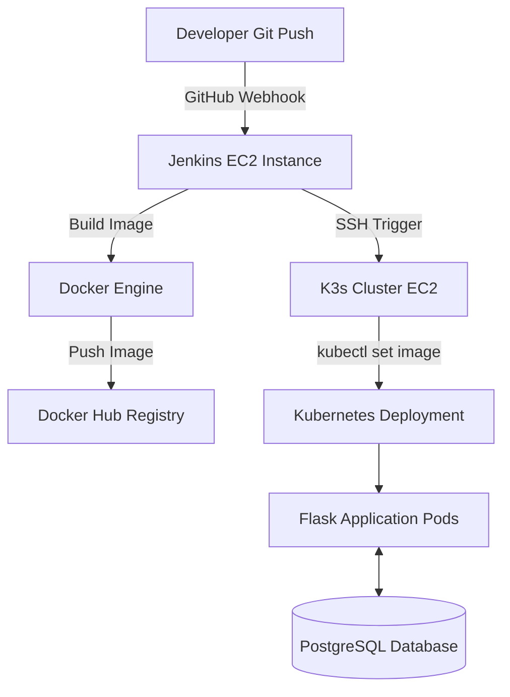

# 🎬 Movie Journal

> **End-to-End DevOps Project** featuring Flask, Docker, Kubernetes (K3s), Jenkins, Terraform, Ansible, Prometheus, Grafana, & AWS.

---

## 📌 Overview

**Movie Journal** is a full-stack web application that allows movie enthusiasts to catalogue their favorite films, manage custom posters, track memorable scenes, and write detailed reviews. 

While the application itself is feature-rich, **the primary objective of this repository is to demonstrate a production-grade, automated CI/CD and Infrastructure-as-Code (IaC) workflow**—from bare-metal AWS provisioning to zero-downtime Kubernetes deployments.

---

## 🚀 Features

- **Film Management:** Add, review, and delete movies with custom ratings.
- **Rich Media Storage:** Upload custom poster art, backdrop imagery, and memorable scene snapshots.
- **Interactive UI:** Responsive, dark-themed interface built for fast browsing.
- **Relational Backend:** Powered by PostgreSQL and SQLAlchemy for reliable data persistence.

---

## 🛠️ Tech Stack & Tools

| Domain | Technologies |
| :--- | :--- |
| **Application** |     |
| **DevOps & CI/CD** |    |
| **Infrastructure** |    |
| **Observability** |   |

---

## 🏗️ Architecture & Pipeline Flow



### CI/CD Deployment Stages

```
Git Push ➔ GitHub Webhook ➔ Jenkins Build ➔ Docker Push ➔ SSH to Cluster ➔ Rolling K8s Update
```

---

## 📁 Project Structure

```text
movies/
├── 📁 ansible/        # Configuration management playbooks
├── 📁 kubernetes/     # Manifests (Deployments, Services, Ingress, Secrets)
├── 📁 monitoring/     # Prometheus & Grafana Helm values
├── 📁 static/         # Frontend CSS, JS, and image uploads
├── 📁 templates/      # Jinja2 HTML templates
├── 📁 terraform/      # AWS Infrastructure provisioning (VPC, EC2, SG)
├── Dockerfile         # App containerization specification
├── Jenkinsfile        # CI/CD pipeline definitions
├── movies.py          # Main Flask application entrypoint
├── seed_movies.py    # Database seeding utility
└── requirements.txt   # Python dependencies
```

---

## ☸️ Kubernetes Infrastructure

The cluster is managed via K3s and utilizes the following native Kubernetes resources:

- **Namespace:** Isolated environment for application resources.
- **Deployments:** Scalable web application and PostgreSQL instances.
- **Services:** Internal ClusterIP communication channels.
- **ConfigMap & Secret:** Safe separation of application configs and environment variables.
- **Ingress:** HTTP routing and external access management.

---

## 📊 Observability & Monitoring

The observability suite is deployed via **Helm**:
- **Prometheus:** Metrics scraping using `prometheus_flask_exporter`.
- **Grafana:** Visual dashboards tracking HTTP requests, latency, memory usage, and cluster health.

---

## ⚡ Deployment & Setup Guide

<details>
<summary><b>Step 1: Provision Cloud Infrastructure (Terraform)</b></summary>

```bash
git clone https://github.com/your-username/movie-journal.git
cd movie-journal/terraform

# Initialize and create AWS VPC, Security Groups, and EC2 instances
terraform init
terraform apply
```
</details>

<details>
<summary><b>Step 2: Configure Server Instances (Ansible)</b></summary>

Update the `ansible/inventory` file with your target server IP addresses:

```bash
cd ../ansible

# Install Jenkins on the CI/CD server
ansible-playbook -i inventory jenkins.yml

# Provision Docker & K3s on the target application node
ansible-playbook -i inventory movies.yml
```
</details>

<details>
<summary><b>Step 3: Setup Jenkins CI/CD Pipeline</b></summary>

1. Access Jenkins via `http://<JENKINS_PUBLIC_IP>:8080`.
2. Configure Credentials:
   - `movie-docker-token-id`: Docker Hub credentials.
   - `movie-ec2-key`: Private SSH key for the K3s server.
3. Create a **Pipeline Job** pointing to the repository's `Jenkinsfile`.
4. Register the Webhook in GitHub Settings:
   `http://<JENKINS_PUBLIC_IP>:8080/github-webhook/`
</details>

<details>
<summary><b>Step 4: Trigger Automated Build</b></summary>

```bash
git add .
git commit -m "feat: trigger deployment pipeline"
git push origin main
```
</details>
