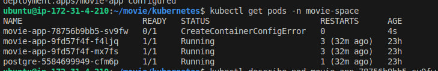
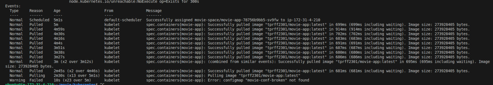
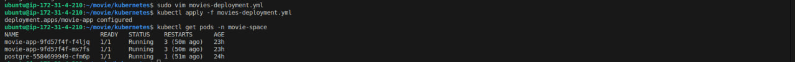

# 🐛 Troubleshooting Case Study: `CreateContainerConfigError`

## 📌 Bug Scenario

After deploying an update to the `movie-app` application, the Kubernetes pod failed to start and remained in a `0/1 READY` state with the status:

```text
CreateContainerConfigError
```

This prevented the application container from being created successfully.

---

## 1. 🔴 Identify the Problem

Checked the status of the pods in the `movie-space` namespace:

```bash
kubectl get pods -n movie-space
```

The `movie-app` pod was not ready and showed:

```text
CreateContainerConfigError
```

This indicated that Kubernetes encountered an error while preparing the container configuration before the container could start.

### 📸 Screenshot: Pod Status

> Replace the path below with your screenshot.



---

## 2. 🔍 Investigate the Pod

To identify the exact reason for the failure, I inspected the pod:

```bash
kubectl describe pod movie-app-78756b9bb5-sv9fw -n movie-space
```

I focused on the **Events** section at the bottom of the output.

The events showed that Kubernetes was unable to find the ConfigMap referenced by the deployment.

### 📸 Screenshot: `kubectl describe pod`



### 🔎 Finding

The error indicated that the application was referencing a ConfigMap that did not exist.

---

## 3. 🧩 Verify the ConfigMap

I listed the ConfigMaps available in the `movie-space` namespace:

```bash
kubectl get configmap -n movie-space
```

The output showed that the existing ConfigMap was named:

```text
movie-conf
```

However, the deployment was referencing:

```text
movie-conf-broken
```

This revealed the root cause: **the deployment referenced an incorrect ConfigMap name.**

### 📸 Screenshot: Existing ConfigMaps


---

## 4. 🛠️ Fix the Configuration

I opened `movies-deployment.yml` and checked fixed the configMapRef.

After correcting the deployment configuration, I applied the updated manifest:

```bash
kubectl apply -f movies-deployment.yml
```

I then checked the pod status again:

```bash
kubectl get pods -n movie-space
```

The pod successfully started and reached:

```text
1/1 READY
```

The `CreateContainerConfigError` was resolved.

### 📸 Screenshot: Pod Running Successfully




