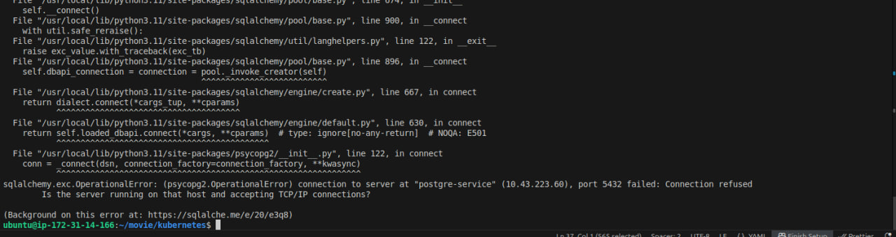
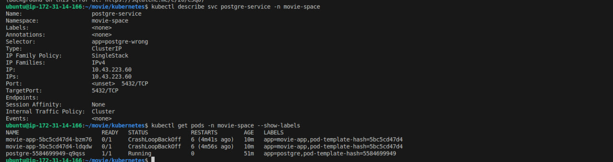

# 🐛 Troubleshooting: Kubernetes Service With No Endpoints

## 📌 Overview

This incident demonstrates how I diagnosed a website outage caused by a Kubernetes Service that was unable to route traffic to the PostgreSQL Pod.
---

## 1. 🔴 Identify the Problem

When I tried to access the website, the application was unavailable and no server response was returned.

### 📸 Screenshot 1: Website Unavailable


---

## 2. 🔍 Check Application Logs

I checked the application logs:

```bash
kubectl logs deployment/movie-app -n movie-space
```

The logs showed that the application could not connect to PostgreSQL because the connection to `postgre-service` was refused.

### 📸 Screenshot 2: Application Logs



---

## 3. 🧩 Find the Root Cause

I inspected the PostgreSQL Service:

```bash
kubectl describe svc postgre-service -n movie-space
```

The Service had **no endpoints**, meaning it was not selecting any Pods.

I then checked the Pod labels:

```bash
kubectl get pods -n movie-space --show-labels
```

The PostgreSQL Pod had:

```text
app=postgre
```

while the Service selector was:

```text
app=postgre-wrong
```

Because the labels did not match, the Service could not route traffic to the PostgreSQL Pod.

### 📸 Screenshot 3: Service Selector and Pod Labels



---

## 4. 🛠️ Fix and Verify

I updated `postgre-service.yml` and changed the Service selector from:

```yaml
selector:
  app: postgre-wrong
```

to:

```yaml
selector:
  app: postgre
```

I applied the updated configuration and verified that the application was working again.

### 📸 Screenshot 4: Fixed Service and Working Application


---

## ✅ Root Cause

**Service selector:** `app=postgre-wrong`
**Pod label:** `app=postgre`

The mismatch caused the Service to have no endpoints and prevented the application from connecting to PostgreSQL.

**Fix:** Updated the Service selector to match the PostgreSQL Pod label.
