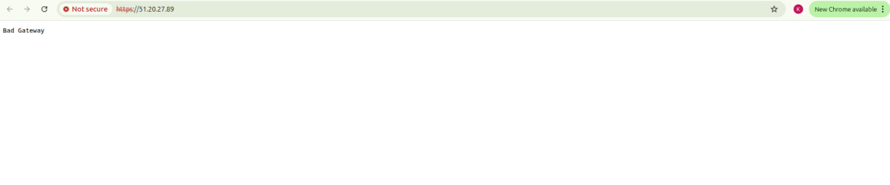
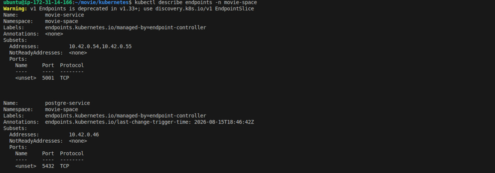
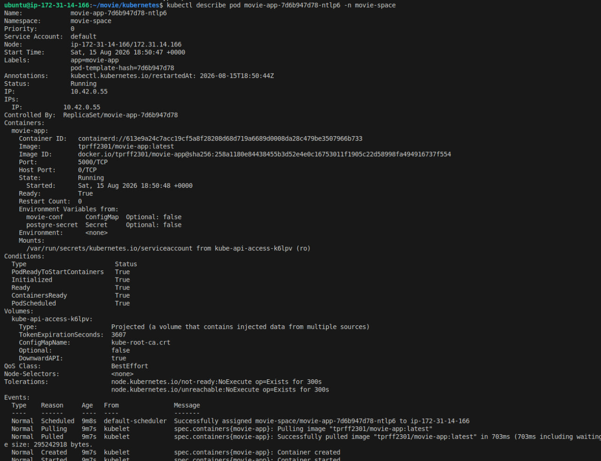
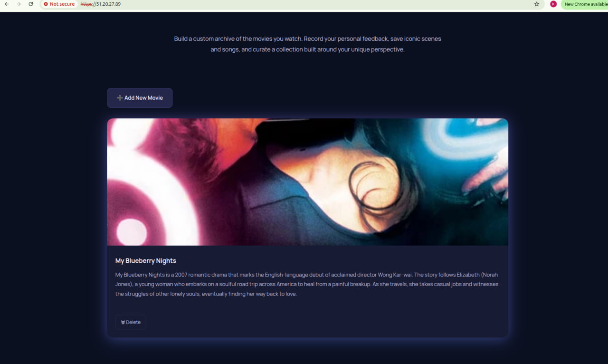

# 🐛 Troubleshooting: Kubernetes 502 Bad Gateway

## 📌 Overview

This incident demonstrates how I diagnosed a **502 Bad Gateway** error caused by a port mismatch between the application container and the Kubernetes Service.

---

## 1. 🔴 Identify the Problem

When I tried to access the website, it returned a **502 Bad Gateway** error.

### 📸 Screenshot 1: 502 Bad Gateway



---

## 2. 🔍 Trace the Traffic Path

I first checked the Ingress configuration to verify how external traffic was being routed:

```bash
kubectl get ingress -n movie-space
kubectl describe ingress -n movie-space
```

I then inspected the Kubernetes Services to verify the Service ports and their configuration:

```bash
kubectl get svc -n movie-space
kubectl describe svc -n movie-space
```

Finally, I checked the Service endpoints and the application Pod to trace the connection from the Service to the actual container:

```bash
kubectl get endpoints movie-service -n movie-space
kubectl describe pod movie-app-7d6b947d78-ntlp6 -n movie-space
```

This investigation revealed a **port mismatch**: the container was configured to use port `5000`, while the Pod was listening on port `5001`.

### 📸 Screenshot 2: Ingress and Service Configuration


### 📸 Screenshot 3: Endpoint



### 📸 Screenshot 4: Pod Port Configuration



---

## 3. 🛠️ Fix and Verify

I updated `movie-service.yml` so that the Service forwarded traffic to the port actually used by the application Pod.

After applying the updated configuration, I performed a rollout and verified that the website was accessible again.

### 📸 Screenshot 5: Application Restored



---

## ✅ Root Cause

The Kubernetes networking configuration contained a **port mismatch**:

```text
Container configuration → 5000
Pod listening port      → 5001
```

Because the Service was forwarding traffic to the wrong port, the Ingress returned a **502 Bad Gateway**.

**Fix:** Updated the Service configuration to target the correct Pod port and performed a rollout.

**Result:** The application became accessible again.
