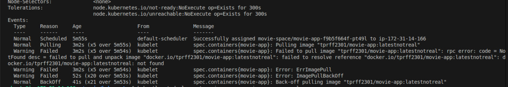
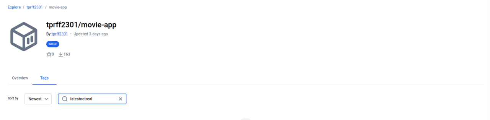
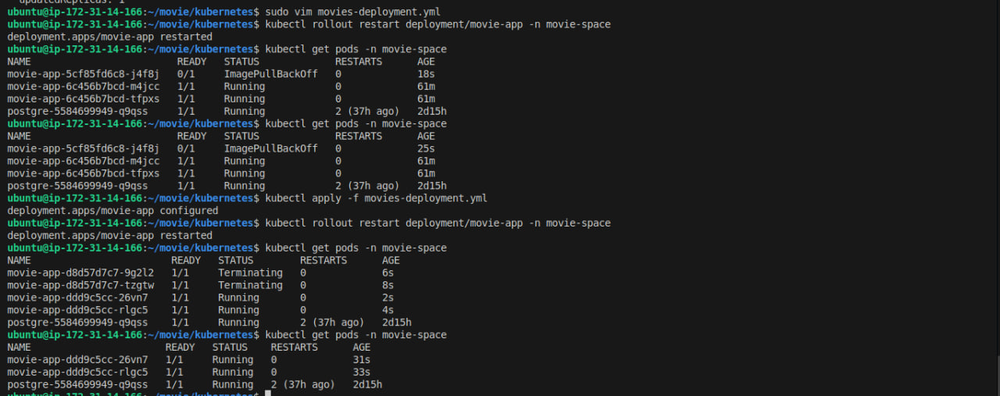

# 🐛 Troubleshooting: Kubernetes `ImagePullBackOff`

## 📌 Overview

This incident demonstrates how I diagnosed and fixed a Kubernetes `ImagePullBackOff` error caused by an incorrect Docker image reference.
---

## 1. 🔴 Identify the Problem

I inspected the failed application Pod:

```bash id="r3x2k7"
kubectl describe pod movie-app-f9b5f664f-pt49l -n movie-space
```

The Pod showed `ImagePullBackOff`.

This means Kubernetes was unable to pull the container image specified by the Deployment. After a failed attempt, Kubernetes progressively waits longer before retrying the image pull.

### 📸 Screenshot 1: `ImagePullBackOff`



---

## 2. 🔍 Verify the Docker Image

I checked the Docker Hub repository to verify that the image referenced by the Deployment actually existed.

The specified image/tag was not available in the repository, confirming that Kubernetes was trying to pull an invalid image reference.

### 📸 Screenshot 2: Image Missing From Docker Hub



---

## 3. 🛠️ Fix and Verify

I identified the correct image tag and updated `movies-deployment.yml` to reference the available image.

I then updated the Deployment and performed a rollout so that the Pods were recreated using the corrected image.

After the rollout, the application Pods successfully started and the `ImagePullBackOff` error was resolved.

### 📸 Screenshot 3: Correct Image and Working Pods



---

## ✅ Root Cause

The Kubernetes Deployment referenced a Docker image tag that did not exist in the registry.

**Fix:** Updated the Deployment with the correct image tag and performed a rollout.

**Result:** Kubernetes successfully pulled the image and the application Pods started normally.
