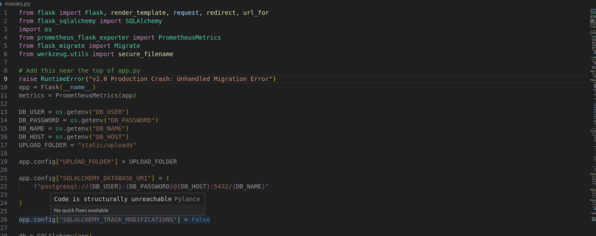
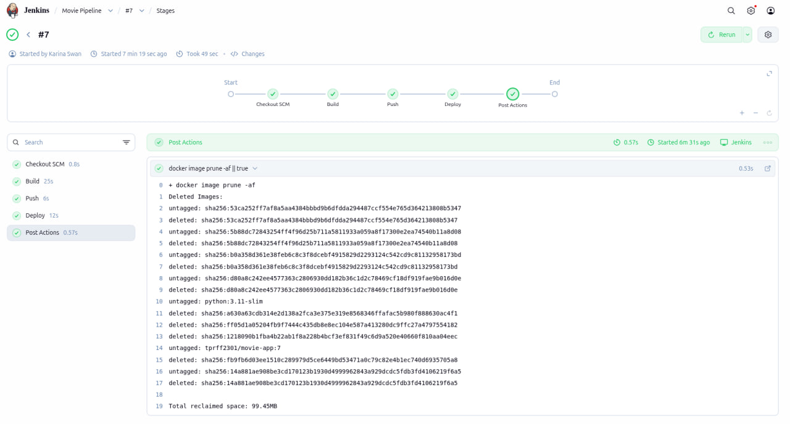
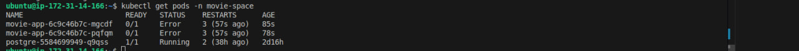
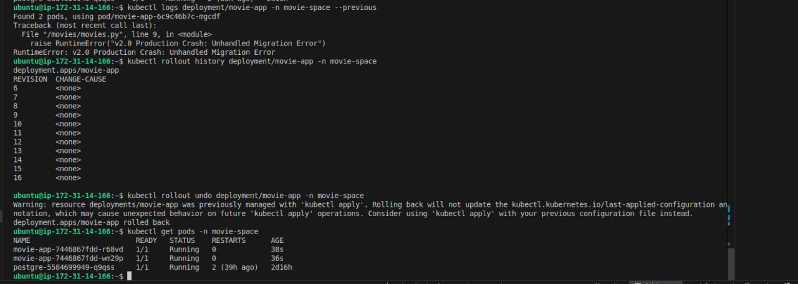

# 🐛 Troubleshooting: Production Deployment Failure and Rollback

## 📌 Overview

This incident demonstrates how I handled a failed application deployment by identifying the faulty release and rolling back to the previous working version.

---

## 1. 🔴 Introduce and Identify the Failure

To simulate a production failure, I intentionally added an unhandled runtime exception to `movies.py`:

```python id="m3j8f1"
raise RuntimeError("v2.0 Production Crash: Unhandled Migration Error")
```

This caused the application to fail when the new version was deployed.

### 📸 Screenshot 1: Introduced Application Error



---

## 2. 🚨 CI/CD Deployment and Pod Failure

After the change was pushed to the repository, a GitHub webhook triggered the Jenkins pipeline.

Jenkins automatically built and deployed the updated application version to the Kubernetes cluster.

After the deployment, the new application version started running in the Pods and the intentional runtime error caused the Pods to fail.

### 📸 Screenshot 2: Jenkins Deployment



### 📸 Screenshot 3: Failed Application Pods



---

## 3. 🔄 Roll Back to the Previous Working Version

I rolled back the Deployment to the previous revision:

```bash id="n8w2cx"
kubectl rollout undo deployment/movie-app -n movie-space
```

This reverted the application to the previous working Deployment revision, allowing Kubernetes to replace the failed Pods with Pods running the known-good version.

### 📸 Screenshot 4: Successful Rollback



---

## ✅ Root Cause

A runtime exception was intentionally introduced into the application and deployed through the CI/CD pipeline.

**Fix:** Rolled back the Kubernetes Deployment to the previous working revision.

**Result:** The faulty release was removed and the application was restored using the previous working version.
