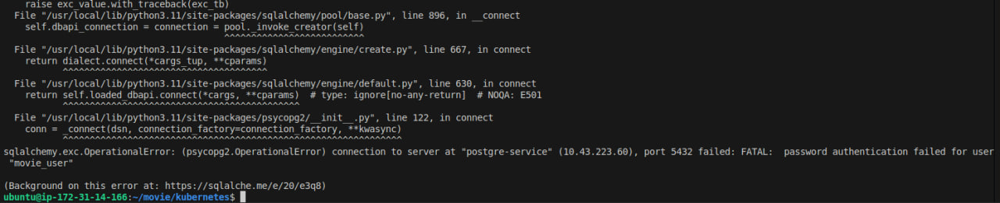
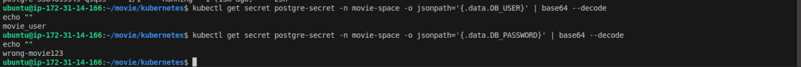
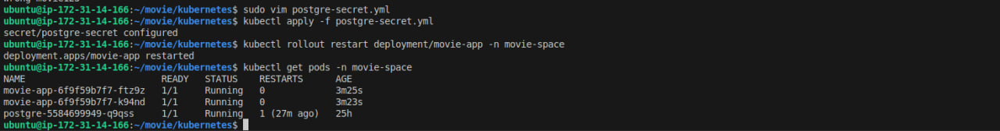

# 🐛 Troubleshooting: PostgreSQL Authentication Failure

## 📌 Overview

This incident demonstrates how I diagnosed and fixed a database authentication failure that caused the `movie-app` pods to fail.

**Root cause:** The PostgreSQL password stored in the Kubernetes Secret did not match the credentials expected by the database.

---

## 1. 🔴 Identify the Problem

The website became unavailable, so I checked the application pods and found that the `movie-app` pods were failing.

I then checked the application logs:

```bash
kubectl logs deployment/movie-app -n movie-space
```

The logs showed:

```text
password authentication failed for user "movie_user"
```

This indicated that the application could reach PostgreSQL, but the provided credentials were incorrect.

### 📸 Screenshot 1: Pod Error and Database Authentication Failure



---

## 2. 🔍 Verify the Stored Credentials

I checked the credentials stored in the Kubernetes Secret by decoding `DB_USER` and `DB_PASSWORD`:

```bash
kubectl get secret postgre-secret -n movie-space -o jsonpath='{.data.DB_USER}' | base64 --decode
echo ""

kubectl get secret postgre-secret -n movie-space -o jsonpath='{.data.DB_PASSWORD}' | base64 --decode
echo ""
```

The decoded values revealed that the stored password was incorrect.

### 📸 Screenshot 2: Incorrect Database Credentials



---

## 3. 🛠️ Fix and Verify

I updated the password in `postgre-secret.yml` to the correct value and reapplied the Secret configuration.

> ⚠️ **Production note:** The password is stored directly in this YAML file only for this learning project. In a production environment, credentials should not be committed to Git. Secrets should be managed using a secure solution such as a secrets manager or an appropriate Kubernetes secret-management workflow.

After updating the credentials, I applied the changes and verified that the application pods recovered successfully.

### 📸 Screenshot 3: Corrected Credentials and Working Application




