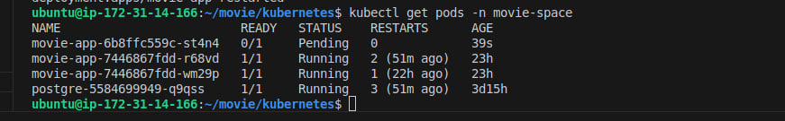
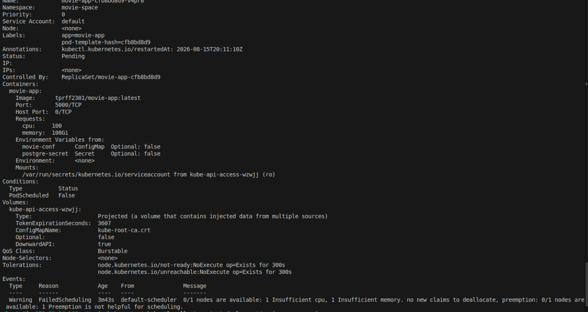

# 🐛 Troubleshooting: Kubernetes Pod Stuck in `Pending`

## 📌 Overview

This incident demonstrates how I diagnosed a Kubernetes Pod that could not be scheduled because the cluster did not have enough available resources to satisfy its resource requests.

---

## 1. 🔴 Identify the Problem

One of the `movie-app` Pods failed to start and remained in the `Pending` state.

A `Pending` Pod has been accepted by Kubernetes but has not yet been successfully scheduled onto a node.

### 📸 Screenshot 1: Pod Stuck in `Pending`



---

## 2. 🔍 Investigate the Scheduling Failure

Since the Pod had not started, I used `kubectl describe` to investigate why Kubernetes could not schedule it:

```bash
kubectl describe pod movie-app-6b8ffc559c-st4n4 -n movie-space
```

The Events section showed that the requested resources were not available on the node.

This indicated a **resource scheduling issue**, rather than an application or container failure.

### 📸 Screenshot 2: Insufficient Resources



---

## 3. 🛠️ Remove the Unnecessary Resource Requests

I checked `movies-deployment.yml` and found that the application had explicit CPU and memory requests configured.

For this small portfolio project, these requests were unnecessary because the application is lightweight and runs on a single small Kubernetes node. Resource requests tell Kubernetes how much CPU and memory must be available before a Pod can be scheduled, so unnecessarily high requests can prevent the Pod from being scheduled even when the application itself would use much less.

I removed the unnecessary `resources.requests` section from the Deployment and applied the updated configuration.

The Pod was then successfully scheduled and started.

### 📸 Screenshot 3: Fixed Deployment and Running Pod


---

## ✅ Root Cause

The Pod had resource requests that could not be satisfied by the available cluster capacity.

**Fix:** Removed the unnecessary resource requests from the Deployment.

**Result:** Kubernetes was able to schedule the Pod and the application started successfully.
