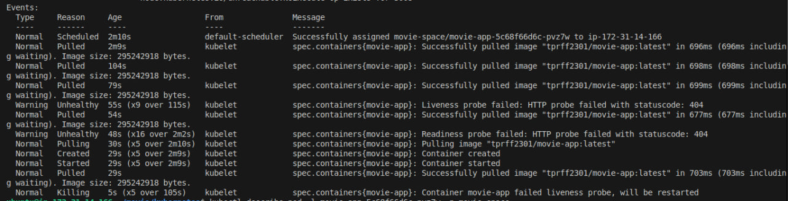
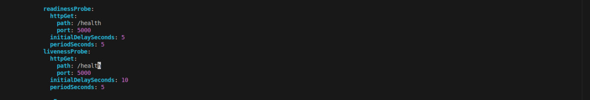

# 🐛 Troubleshooting: Kubernetes Health Probe Failure

## 📌 Overview

This incident demonstrates how I diagnosed a Kubernetes Pod that was running but not considered healthy because its HTTP health probes were checking an incorrect application route.

---

## 1. 🔴 Identify the Problem

The `movie-app` Pod was running, but it was not marked as `READY`.

This indicated that the container process was running, but Kubernetes did not consider the application healthy enough to receive traffic.

### 📸 Screenshot 1: Pod Running but Not Ready


---

## 2. 🔍 Investigate the Health Probes

I inspected the Pod to investigate the readiness and liveness failures:

```bash id="u5q6km"
kubectl describe pod movie-app-5c68f66d6c-pvz7w -n movie-space
```

The Events section showed that both probes were failing with:

```text id="3r5z3s"
Readiness probe failed: 404 Not Found
Liveness probe failed: 404 Not Found
```

The failed **readiness probe** caused Kubernetes to remove the Pod from the Service endpoints, preventing traffic from being sent to it.

The failed **liveness probe** caused the kubelet to repeatedly restart the container because Kubernetes considered the application unhealthy.

### 📸 Screenshot 2: Failed Health Probes



---

## 3. 🧩 Find and Fix the Incorrect Path

Kubernetes health probes send HTTP requests to a specific application route. I checked `movies.py` to verify which routes were actually defined by the Flask application.

### 📸 Screenshot 3: Flask Application Route


I then checked `movies-deployment.yml` and found that the probe path did not match the application's actual route.

I corrected the probe path so that Kubernetes would check a valid endpoint.

### 📸 Screenshot 4: Corrected Probe Path



---

## 4. ✅ Verify the Fix

After applying the updated Deployment, the health probes began succeeding and the Pod became ready to receive traffic.

### 📸 Screenshot 5: Pod Healthy and Ready


---

## 🎯 Root Cause

The Kubernetes health probes were configured with an incorrect HTTP path, causing the Flask application to return `404 Not Found`.

**Fix:** Updated the `livenessProbe` and `readinessProbe` paths to match a valid Flask route.

**Result:** The probes succeeded, the Pod became `READY`, and Kubernetes restored it to the Service endpoints.
