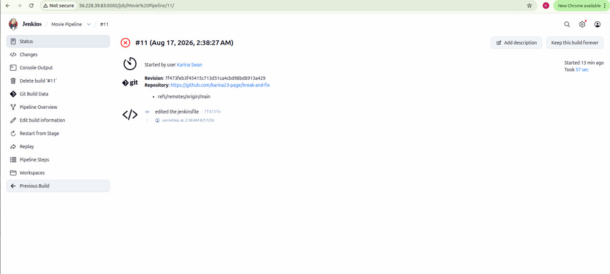
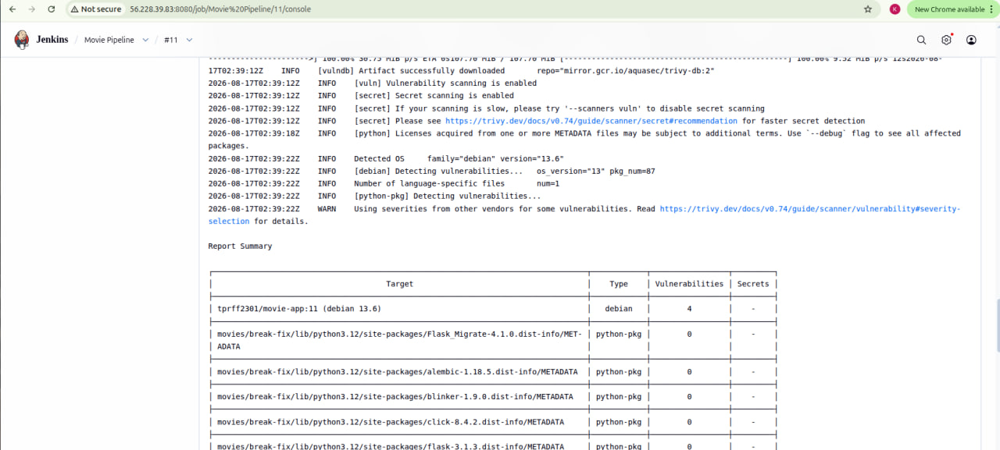
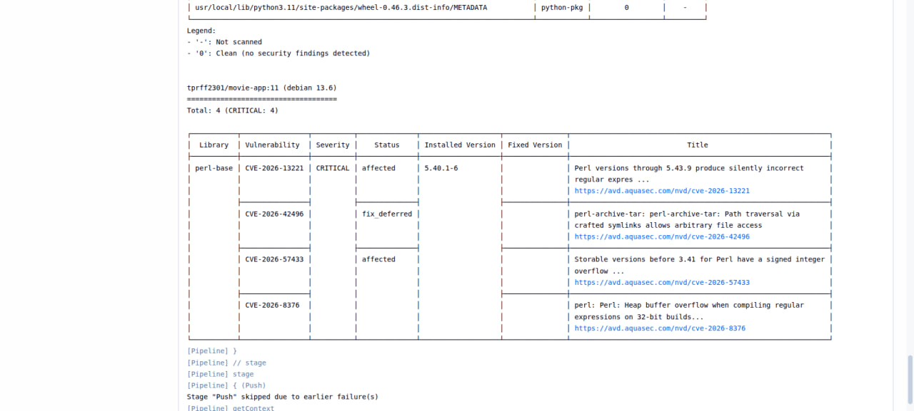
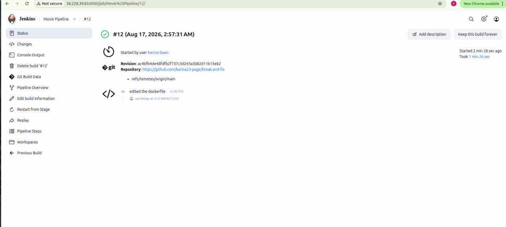

# 🐛 Troubleshooting: CI/CD Build Failure Caused by Docker Image Vulnerabilities

## 📌 Overview

This incident demonstrates how I investigated a failed CI/CD build caused by vulnerabilities detected in the Docker base image.

---

## 1. 🔴 Identify the Failed Build

The CI/CD pipeline failed during the build process, so I checked the pipeline output to identify the cause of the failure.

### 📸 Screenshot 1: Failed Build



---

## 2. 🔍 Identify the Security Issue

The container scanning tool reported that the Debian OS layer contained **4 vulnerabilities**:

```text
Debian 13.6: 4 vulnerabilities
```

This indicated that the failure was related to vulnerabilities in the underlying container image rather than the application code itself.

### 📸 Screenshot 2: Vulnerability Scan



---

## 3. 🧩 Find the Source of the Vulnerability

I investigated the reported vulnerabilities and found that the `perl-base` system package was inherited from the `python:3.11-slim` base image.

System-level packages included in Debian-based images can contain known CVEs that may cause security scanners to fail a build.

### 📸 Screenshot 3: Vulnerable Package



---

## 4. 🛠️ Replace the Base Image and Verify

I looked for a lighter alternative to the Debian-based Python image and switched to an Alpine-based Python image.

Alpine uses `musl` libc and BusyBox instead of the larger Debian userspace, resulting in a smaller OS footprint and potentially fewer OS-level vulnerabilities.

After replacing the base image, I ran the pipeline again and the build completed successfully.

### 📸 Screenshot 4: Successful Pipeline



---

## 🎯 Root Cause

The `python:3.11-slim` base image contained vulnerable Debian system packages that caused the security scan to fail the build.

**Fix:** Replaced the Debian-based Python image with an Alpine-based image.

**Result:** The security scan passed and the CI/CD pipeline completed successfully.
