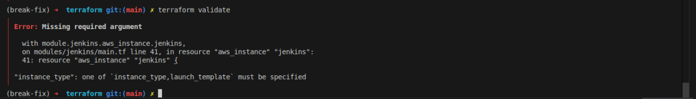
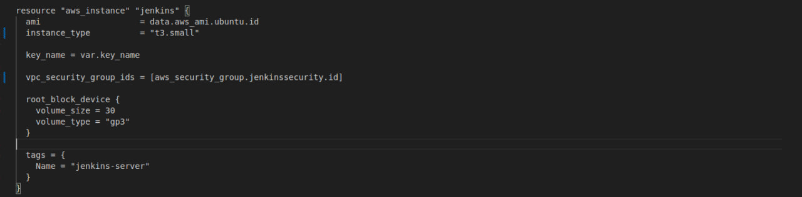
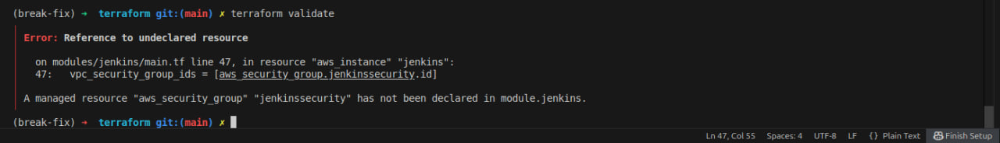
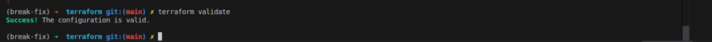

# 🐛 Troubleshooting: Terraform Validation Errors

## 📌 Overview

This incident demonstrates how I fixed two Terraform configuration errors in the Jenkins EC2 module.

---

## 1. 🔴 Identify the First Error

I ran:

```bash
terraform validate
```

Terraform reported that the `aws_instance` resource was missing the required `instance_type` argument:

```text
Error: Missing required argument

"instance_type": one of `instance_type,launch_template` must be specified
```

### 📸 Screenshot 1: Missing `instance_type`



---

## 2. 🛠️ Add the Required Instance Type

I checked `modules/jenkins/main.tf` and added the missing `instance_type`:

```hcl
resource "aws_instance" "jenkins" {
  ami           = data.aws_ami.ubuntu.id
  instance_type = "t3.small"

  key_name = var.key_name

  vpc_security_group_ids = [
    aws_security_group.jenkins-security.id
  ]

  root_block_device {
    volume_size = 30
    volume_type = "gp3"
  }

  tags = {
    Name = "jenkins-server"
  }
}
```

I chose `t3.small` because this Jenkins server is used for a small portfolio project and does not require significant compute capacity.

### 📸 Screenshot 2: Added `instance_type`



---

## 3. 🔍 Investigate the Next Validation Error

I ran `terraform validate` again.

The first error was resolved, but Terraform reported a new error:

```text
Error: Reference to undeclared resource

A managed resource "aws_security_group" "jenkinssecurity"
has not been declared in module.jenkins.
```

This indicated that Terraform could not find the Security Group resource referenced by the EC2 instance.

### 📸 Screenshot 3: Undeclared Security Group



---

## 4. ✅ Correct the Resource Reference

I checked the Security Group declaration and found that its actual resource name was:

```hcl
resource "aws_security_group" "jenkins-security" {
```

However, the EC2 resource was referencing:

```hcl
aws_security_group.jenkinssecurity.id
```

The resource names did not match. I corrected the reference to use the actual resource name, including the hyphen:

```hcl
aws_security_group.jenkins-security.id
```

After making the change, I ran `terraform validate` again and the configuration passed validation.

### 📸 Screenshot 4: Corrected Resource Reference



---

## 🎯 Root Cause

Two configuration issues were identified:

1. The `aws_instance` resource was missing the required `instance_type` argument.
2. The EC2 instance referenced a Security Group using an incorrect resource name.

**Fix:** Added `instance_type = "t3.small"` and corrected the Security Group resource reference.

**Result:** `terraform validate` completed successfully.
