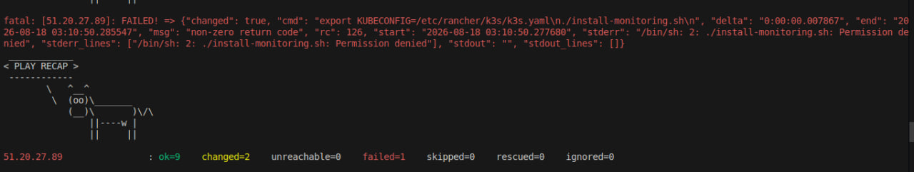
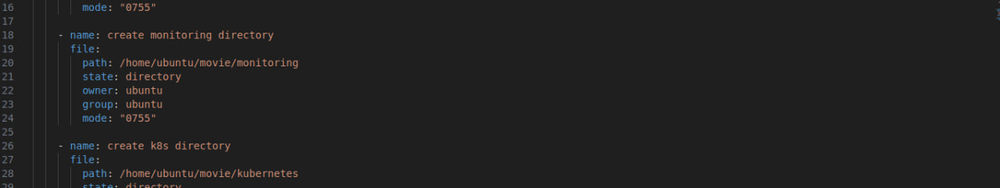
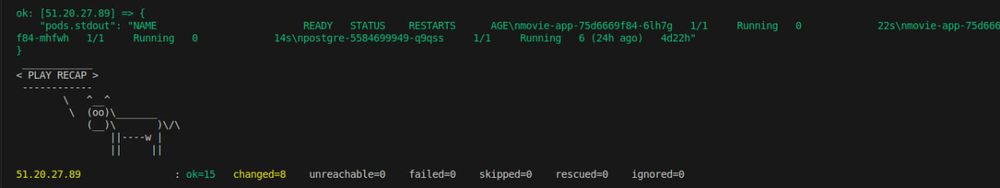

# 🐛 Troubleshooting: Ansible Playbook Permission Error

## 📌 Overview

This incident demonstrates how I diagnosed and fixed an Ansible playbook failure caused by insufficient execute permissions on a shell script.

---

## 1. 🔴 Identify the Problem

My Ansible playbook failed during the task that executed the `install-monitoring.sh` script.

The output showed that the script could not be executed because of a **permission denied** error.

### 📸 Screenshot 1: Ansible Permission Error



---

## 2. 🛠️ Fix the Script Permissions

I checked the Ansible task and the `install-monitoring.sh` script.

The script did not have the required execute permission, so I configured Ansible to set its permissions to `0755` before executing it.

```yaml id="wz2c4h"
mode: '0755'
```

This gives the owner read, write, and execute permissions, while allowing the group and other users to read and execute the script.

### 📸 Screenshot 2: Corrected Script Permissions



---

## 3. ✅ Verify the Fix

I ran the Ansible playbook again after applying the permission change.

The playbook completed successfully without the previous permission error.

### 📸 Screenshot 3: Successful Ansible Playbook



---

## 🎯 Root Cause

The `install-monitoring.sh` script did not have execute permission, so Ansible could not run it.

**Fix:** Set the script permissions to `0755` before execution.

**Result:** The Ansible playbook completed successfully.
